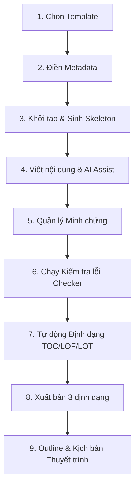

# Kịch bản tích hợp End-to-end Báo cáo Dự án thực tế (E2E Scenario)

Tài liệu này hướng dẫn chi tiết kịch bản kiểm thử tích hợp toàn bộ các tính năng của ReportSupporter từ bước khởi tạo cho đến đóng gói sản phẩm và thuyết trình dự án thực tế.

---

## 🧭 Bản đồ kịch bản E2E

Kịch bản E2E mô tả việc hoàn thành một báo cáo dự án phần mềm ("Báo cáo Dự án Công nghệ Thông tin") qua 9 bước tuần tự:

---

## 📝 Chi tiết 9 bước thực hiện

### Bước 1: Lựa chọn Mẫu Báo cáo (Template Selection)
- **Hành động**: Tại màn hình khởi tạo ban đầu, chọn mẫu báo cáo phù hợp từ danh sách:
  1. **Software Project Report Template** (Mẫu báo cáo dự án phần mềm).
  2. **Lab Report Template** (Mẫu báo cáo thực hành).
  3. **Internship Report Template** (Mẫu báo cáo thực tập).
- **Mục tiêu**: Chọn mẫu **Software Project Report Template** cho dự án phần mềm.

### Bước 2: Điền thông tin Metadata ban đầu
- **Hành động**: Điền các trường thông tin cấu hình bắt buộc trong form Metadata:
  - **Tiêu đề báo cáo**: `Báo cáo dự án Xây dựng Hệ thống Quản lý Báo cáo`
  - **Tên dự án**: `ReportSupporter`
  - **Thành viên**: `Nguyễn Văn A, Trần Thị B`
  - **Giảng viên hướng dẫn**: `TS. Nguyễn Văn C`
- **Mục tiêu**: Đảm bảo điền đầy đủ và đúng định dạng yêu cầu của schema.

### Bước 3: Khởi tạo và Sinh khung xương (Skeleton Generation)
- **Hành động**: Bấm nút **"Khởi tạo báo cáo"**.
- **Kết quả mong đợi**:
  - Trình soạn thảo (Workspace Editor) mở ra ở phần `/`.
  - Khung xương tài liệu Markdown tự động sinh ra dựa theo Template đã chọn và các trường Metadata vừa nhập.
  - Các mục như **"Mở đầu"**, **"Yêu cầu hệ thống"**, **"Thiết kế kiến trúc"**, **"Kết quả thực nghiệm"** và **"Kết luận"** được chia thành các Section riêng biệt.

### Bước 4: Viết nội dung Section & Sử dụng AI Trợ giúp (Viết lại / Cải thiện văn phong)
- **Hành động**:
  - Chọn một Section cụ thể (Ví dụ: *Yêu cầu hệ thống*).
  - Viết nội dung Markdown thô vào trình soạn thảo.
  - Bật AI trong Cấu hình (Config) của hệ thống (nếu dùng AI).
  - Bấm **"Viết lại đoạn (AI)"** hoặc **"Cải thiện văn phong (AI)"** để xem gợi ý.
  - Trình duyệt hiển thị màn hình **So sánh khác biệt (SuggestionDiff)** màu Đỏ/Xanh.
  - Bấm **"Chấp nhận" (Accept)** để áp dụng nội dung mới, hoặc **"↩️ Hoàn tác" (Undo)** để phục hồi nội dung viết tay gốc.
  - *Lưu ý*: Nếu AI OFF, trình soạn thảo vẫn hoạt động bình thường cho phép chỉnh sửa thủ công và không hiển thị thanh điều khiển `UserControlBar` trống rỗng.

### Bước 5: Đính kèm Minh chứng dự án (Evidence Kit)
- **Hành động**:
  - Mở panel **"Evidence Panel"** ở phía dưới bên phải.
  - Bấm **"Thêm minh chứng"** để thêm một minh chứng mới:
    - **ID**: `ev-code-1`
    - **Loại**: `code` (mã nguồn)
    - **Nội dung/Liên kết**: `https://github.com/CuongVo24/ReportSupporter/blob/main/src/app/globals.css`
    - **QR Code**: Bật `QR Enabled`.
  - Tham chiếu minh chứng này trong nội dung Section bằng cú pháp: `[Minh chứng mã nguồn](evidence://ev-code-1)`.
- **Kết quả mong đợi**: Mã QR tự động được tạo từ liên kết và chèn vào phần phụ lục minh chứng ở cuối tài liệu.

### Bước 6: Kiểm tra lỗi tự động (Quality Checker)
- **Hành động**: Bấm nút **"Chạy kiểm tra"** tại panel **CheckerPanel**.
- **Kết quả mong đợi**: Checker quét toàn bộ tài liệu và trả về điểm số sẵn sàng (Readiness Score) cùng danh sách lỗi/cảnh báo:
  - Kiểm tra tiêu đề ảnh (`Figure: caption` đúng định dạng).
  - Kiểm tra tiêu đề bảng (`Table: caption` đúng định dạng).
  - Kiểm tra độ rộng của bảng (`Table width` trong giới hạn).
  - Kiểm tra cấp độ tiêu đề không bị nhảy cóc (Heading levels).
  - Quét xem có sót từ khóa cảnh báo nháp (`TODO`, `FIXME`, `DRAFT`).
  - Kiểm tra tính hợp lệ của tham chiếu minh chứng (không bị hỏng liên kết).

### Bước 7: Tự động Định dạng và Đánh số (Auto-Formatting)
- **Hành động**: Bật các tùy chọn định dạng trong preview hoặc cấu hình:
  - **Tự động đánh số Tiêu đề**: Các thẻ H1, H2, H3 được đánh số phân cấp tự động (Ví dụ: `1. Mở đầu`, `1.1. Bối cảnh`).
  - **Sinh Mục lục (TOC)**: Mục lục tự động hiển thị ở đầu trang preview/export và hỗ trợ anchor link liên kết đến từng section tương ứng.
  - **Danh mục hình ảnh (LOF) & Danh mục bảng biểu (LOT)**: Tự động tổng hợp danh sách các ảnh và bảng được đánh số theo đúng chuẩn tài liệu khoa học/kỹ thuật.

### Bước 8: Xuất bản báo cáo ra 3 định dạng (Multi-Format Export)
- **Hành động**: Tại panel **ExportPanel**, bấm xuất bản lần lượt 3 định dạng:
  - **HTML**: Xuất ra trang web tĩnh có tích hợp mục lục hoạt động.
  - **PDF**: Xuất ra tài liệu PDF hỗ trợ phân trang chuẩn, ngắt trang hợp lý và giữ nguyên định dạng in ấn.
  - **Word (DOCX)**: Xuất ra tệp tin `.docx` có cấu trúc rõ ràng mở được bằng Microsoft Word.
- **Kết quả mong đợi**: Cả 3 định dạng đều xuất bản thành công không gặp lỗi runtime, nội dung đồng nhất.

### Bước 9: Trình bày dự án (Present Panel / AI Slides Outline)
- **Hành động**: Mở panel **PresentPanel** và chuyển đổi giữa các tab:
  - **Slides Outline**: Hiển thị dàn bài các slides. Bấm **"Tối ưu Outline bằng AI"** để nhận dàn bài gợi ý từ AI, sau đó chỉnh sửa trực tiếp.
  - **Kịch bản nói (Speaker Script)**: Soạn thảo kịch bản nói chi tiết cho từng slide.
  - **Hỏi đáp phản biện (Defense Q&A)**: Xem và trả lời các câu hỏi phản biện giả lập.
  - **Gợi ý sửa lỗi (Weak Section Warnings)**: Xem danh sách cảnh báo những phần nội dung yếu cần bổ sung.
- **Kết quả mong đợi**: Hiển thị đầy đủ thông tin thời lượng slide, phân vai người nói, và liên kết đến các minh chứng tương ứng.

---

## 🛠️ Danh sách Kiểm thử E2E thủ công & Kết quả phát hiện

Khi chạy kịch bản E2E trên với AI OFF (kịch bản cơ bản nhất), nhóm ghi nhận các kết quả kiểm tra như sau:

| Bước | Tính năng kiểm tra | Trạng thái | Ghi chú / Lỗi phát hiện |
|---|---|---|---|
| 1 | Lựa chọn mẫu (Template Picker) | ✅ PASS | Hoạt động mượt mà. |
| 2 | Nhập Metadata và Validate | ✅ PASS | Validate chính xác các trường rỗng/thiếu. |
| 3 | Sinh khung xương (Skeleton Gen) | ✅ PASS | Cấu trúc sinh ra chuẩn xác. |
| 4 | Trình soạn thảo & Preview | ✅ PASS | Đồng bộ thời gian thực mượt mà. |
| 5 | Quản lý minh chứng (Evidence QR) | ✅ PASS | QR sinh thành công, liên kết hoạt động tốt. |
| 6 | Checker tự động quét lỗi | ✅ PASS | Báo cáo đầy đủ danh sách lỗi và điểm số. |
| 7 | Đánh số Heading & Mục lục | ✅ PASS | Các tiêu đề được đánh số tuần tự chính xác. |
| 8 | Xuất bản 3 định dạng (HTML/PDF/DOCX) | ✅ PASS | Export hoàn tất thành công. |
| 9 | Slides & Kịch bản thuyết trình | ✅ PASS | Outline, kịch bản, thời lượng chạy ổn định. |

### 🔍 Kết luận E2E
Không phát hiện lỗi nghiêm trọng (no critical blocker) cản trở luồng nghiệp vụ E2E cốt lõi khi chạy với AI OFF. Hệ thống đạt trạng thái sẵn sàng để validate tiếp các bước xuất bản đa template (Day 2) và đánh bóng giao diện (Day 3-5).
