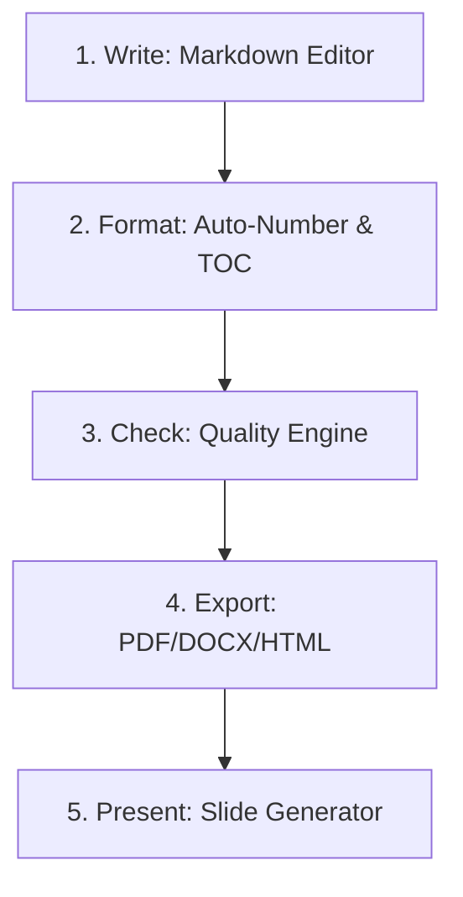

# 📝 ReportSupporter — Trợ lý Số hóa & Chuẩn hóa Báo cáo Học thuật

[](https://nextjs.org/)
[](https://www.typescriptlang.org/)
[](LICENSE)
[](http://makeapullrequest.com)

> **"Viết một lần, xuất mọi định dạng chuẩn nộp bài."**
>
> **ReportSupporter** là một không gian làm việc (workspace) chạy trên trình duyệt giúp sinh viên và các nhóm dự án biến nội dung Markdown thô thành bộ hồ sơ nộp bài hoàn chỉnh, chuẩn hóa và thuyết phục nhất: từ báo cáo A4, tài liệu DOCX, phụ lục minh chứng dạng QR, cho đến slide thuyết trình.

---

## 💡 Tại sao lại cần ReportSupporter?

Việc làm báo cáo đồ án hoặc báo cáo tốt nghiệp thường gặp phải những "cơn ác mộng":
* 🤯 **Mất hàng giờ chỉnh format Microsoft Word**: Lệch lề, nhảy trang, lỗi font, đánh số mục lục thủ công.
* ⚠️ **Thiếu sót nội dung quan trọng**: Quên đưa link mã nguồn, thiếu sơ đồ phân công, thiếu bảng chú thích hình ảnh/bảng biểu.
* 🔗 **Minh chứng rời rạc**: Link video demo, mã nguồn GitHub hay link deploy sản phẩm bị rải rác, thầy cô chấm bài rất khó tiếp cận.
* 🕒 **Tốn thời gian làm slide**: Viết xong báo cáo lại phải copy từng phần sang PowerPoint để làm slide thuyết trình.

**ReportSupporter giải quyết toàn bộ các vấn đề trên ngay trên môi trường Offline-First, bảo mật và siêu mượt.**

---

## 🚀 Các Tính Năng Cốt Lõi (5 Modules)

Hệ thống được thiết kế xoay quanh vòng lặp khép kín giúp nâng tầm chất lượng báo cáo:



### 1. ✍️ Module 1: Write (Soạn thảo tối giản)
* Soạn thảo bằng Markdown trực quan kết hợp live preview.
* Hỗ trợ chèn ảnh, bảng biểu, khối mã nguồn (code block), công thức toán học (LaTeX) và biểu đồ Mermaid.
* Hệ thống mẫu (Template) báo cáo chuẩn khoa/trường giúp sinh skeleton tự động chỉ với việc điền metadata.
* Tự động lưu bản nháp liên tục vào cơ sở dữ liệu trình duyệt (IndexedDB) — hoàn toàn offline.

### 2. 🎨 Module 2: Format (Chuẩn hóa tự động)
* Áp dụng luật dàn trang A4 chuẩn học thuật (Times New Roman, cỡ chữ 13pt/14pt, giãn dòng 1.5, căn lề justify).
* Tự động đánh số chương mục dạng phân cấp (`1.`, `1.1.`, `1.1.1.`).
* Trích xuất và tự động tạo Mục lục (Table of Contents), Danh mục hình vẽ (LoF), Danh mục bảng biểu (LoT).

### 3. 🔍 Module 3: Check (Trợ lý kiểm định trước khi nộp)
* Hệ thống Checker chạy offline quét toàn bộ AST để phát hiện lỗi:
  * Thiếu các chương mục bắt buộc của template.
  * Lỗi nhảy cấp tiêu đề (heading jump), thiếu ngôn ngữ trong code block.
  * Thiếu nhãn/chú thích hình vẽ hoặc bảng biểu.
  * Phát hiện văn bản nháp còn sót lại (`TODO`, `lorem ipsum`).
* Tính toán **Readiness Score (0-100)** biểu thị mức độ sẵn sàng nộp bài.

### 4. 📤 Module 4: Export (Xuất đa định dạng trung thực)
* **HTML**: Xuất tệp HTML tự chứa (self-contained) ngoại tuyến, nhúng ảnh dạng base64.
* **PDF**: Hỗ trợ xuất PDF chất lượng thông qua in trình duyệt (`exportPdfViaBrowserPrint()`) hoặc dựng server-side qua Puppeteer ở giai đoạn nâng cao.
* **DOCX**: Dựng tệp Word có cấu trúc từ AST để biên tập sâu hơn.

### 5. 🔗 Evidence Kit & Present (Bằng chứng số hóa & Thuyết trình)
* **Evidence Kit (Tuần 5+)**: Quản lý 8 loại minh chứng phổ biến (GitHub, Youtube, Figma...). Tự động sinh bảng phụ lục minh chứng đính kèm **mã QR** trực quan cho thầy cô quét nhanh khi chấm bài.
* **Present (Giai đoạn sau)**: Tự động trích xuất cấu trúc báo cáo để dựng slide dàn ý thuyết trình tương ứng.

---

## 🛠️ Công Nghệ Sử Dụng

Sản phẩm tuân thủ triết lý hiệu năng cao, tối giản thư viện ngoài và bảo mật tối đa:

* **Frontend Framework**: Next.js 15 (App Router), React, TypeScript.
* **Markdown Pipeline**: Bộ công cụ `unified` (`remark-parse`, `remark-gfm`, `rehype-katex`, `rehype-highlight`, `rehype-stringify`) xử lý AST mượt mà.
* **Performance**: Unified pipeline và Checker được chạy ngầm dưới **Web Worker** để không gây giật lag luồng xử lý giao diện chính (main thread).
* **Storage**: Lưu trữ cục bộ thông qua IndexedDB (thư viện `idb`), không gửi dữ liệu báo cáo lên máy chủ đám mây (Privacy-First).

---

## 📂 Cấu Trúc Thiết Kế Dự Án

Toàn bộ tài liệu phân tích kỹ thuật và lộ trình phát triển được lưu trữ tại thư mục `Design/`:

* [`Design/ProductPRD.md`](Design/ProductPRD.md): Yêu cầu sản phẩm chi tiết và phạm vi tính năng MVP.
* [`Design/Modules/Other/TechnicalStack.md`](Design/Modules/Other/TechnicalStack.md): Stack công nghệ đã khóa và cấu trúc thư mục quy chuẩn.
* [`Design/Modules/Other/PipelineContract.md`](Design/Modules/Other/PipelineContract.md): Quy ước chi tiết về mô hình dữ liệu AST dùng chung.
* [`Design/RoadMap/MasterRoadMap.md`](Design/RoadMap/MasterRoadMap.md): Lộ trình 12 tuần phát triển từ Core MVP đến bản hoàn thiện.

---

## 💻 Hướng Dẫn Phát Triển (Chạy Local)

1. **Khởi tạo và cài đặt dependencies**:
   ```bash
   npm install
   ```

2. **Chạy máy chủ phát triển (Development Server)**:
   ```bash
   npm run dev
   ```
   Mở trình duyệt truy cập `http://localhost:3000` để bắt đầu trải nghiệm workspace.

3. **Kiểm tra chất lượng code trước khi commit**:
   ```bash
   npm run lint
   * npm run typecheck
   * npm test (chạy kiểm thử Checker rules bằng Vitest)
   ```

---
*ReportSupporter được phát triển nhằm mục tiêu giải phóng sinh viên khỏi gánh nặng định dạng tài liệu, tập trung hoàn toàn vào chất lượng nội dung nghiên cứu khoa học.*
